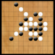
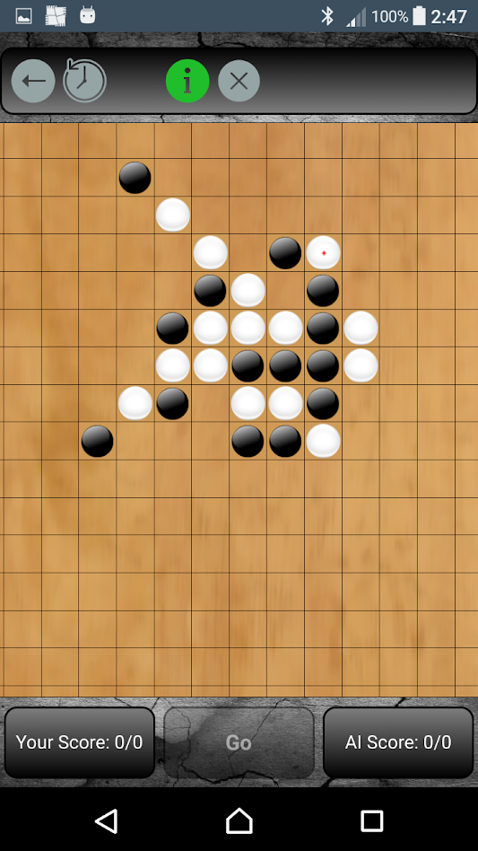
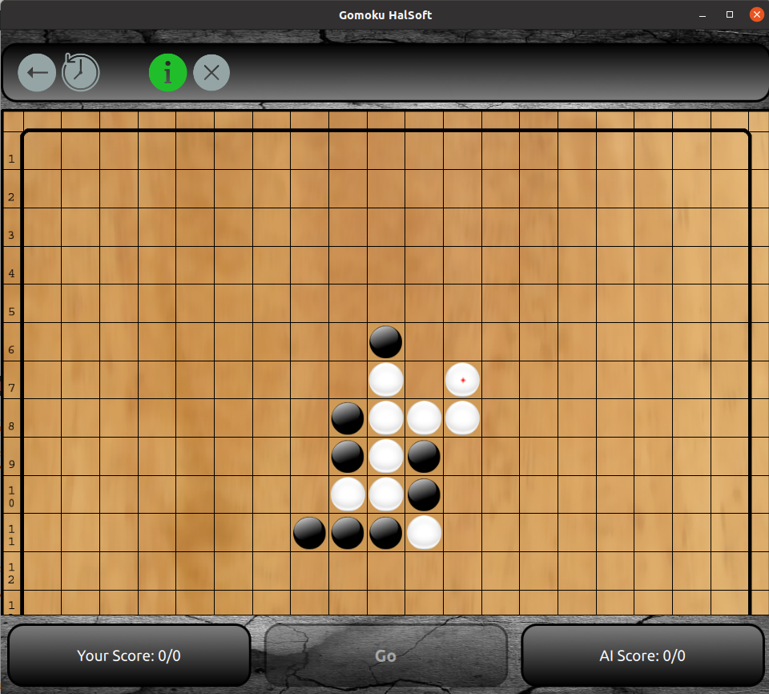

## Gomoku
*Gomoku game engine from scratch to android application*

---
**Discover the ancient game of Gomoku, a timeless classic that has been sharpening minds for centuries. 
Perfect for both casual players and strategic thinkers, Gomoku offers endless fun and mental challenges. 
Gomoku, also known as Five in a Row, is a classic board game that dates back to ancient times.
The goal is simple: be the first to align five stones in a row either horizontally, vertically, or diagonally. 
It's easy to learn but offers deep strategic game play that will keep you hooked.**

Frontend supports:
- GUI - Android
  


- GUI - console
```
--->>Your move:
6 
8
                       1 1 1 1 1 
   0 1 2 3 4 5 6 7 8 9 0 1 2 3 4 
   _ _ _ _ _ _ _ _ _ _ _ _ _ _ _
0 |. . . . . . . . . . . . . . .|
1 |. . . . . . . . . . . . . . .|
2 |. . . . . . . . . . . . . . .|
3 |. . . . . . . . . . . . . . .|
4 |. . . . . . . . . . . . . . .|
5 |. . . . . . . . . . . . . . .|
6 |. . . . . . . . o . . . . . .|
7 |. . . . . . . x . . . . . . .|
8 |. . . . . . . . . . . . . . .|
9 |. . . . . . . . . . . . . . .|
10|. . . . . . . . . . . . . . .|
11|. . . . . . . . . . . . . . .|
12|. . . . . . . . . . . . . . .|
13|. . . . . . . . . . . . . . .|
14|. . . . . . . . . . . . . . .|
  |_ _ _ _ _ _ _ _ _ _ _ _ _ _ _|

--->>Last human move:
(6, 8)
```
- GUI - PC


**Documentation**
- [How it works](c.doc/HowItWorks.md)
- [How to setup toolchain](c.doc/HowToSetupToolchain.md)
- [How to build](c.doc/HowToBuild.md)
- [How to deploy](c.doc/HowToDeploy.md)
- [How to improve](c.doc/HowToImprove.md)
