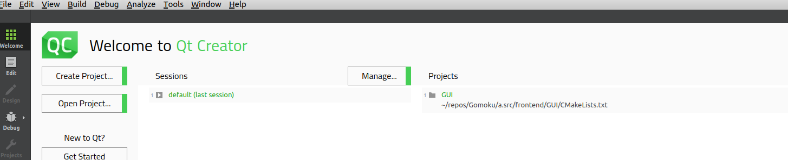
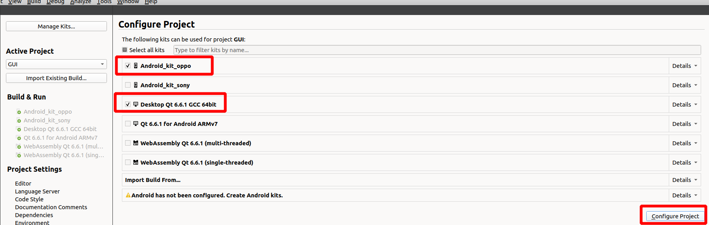
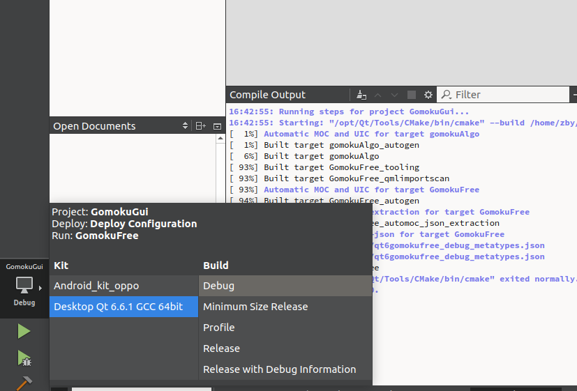
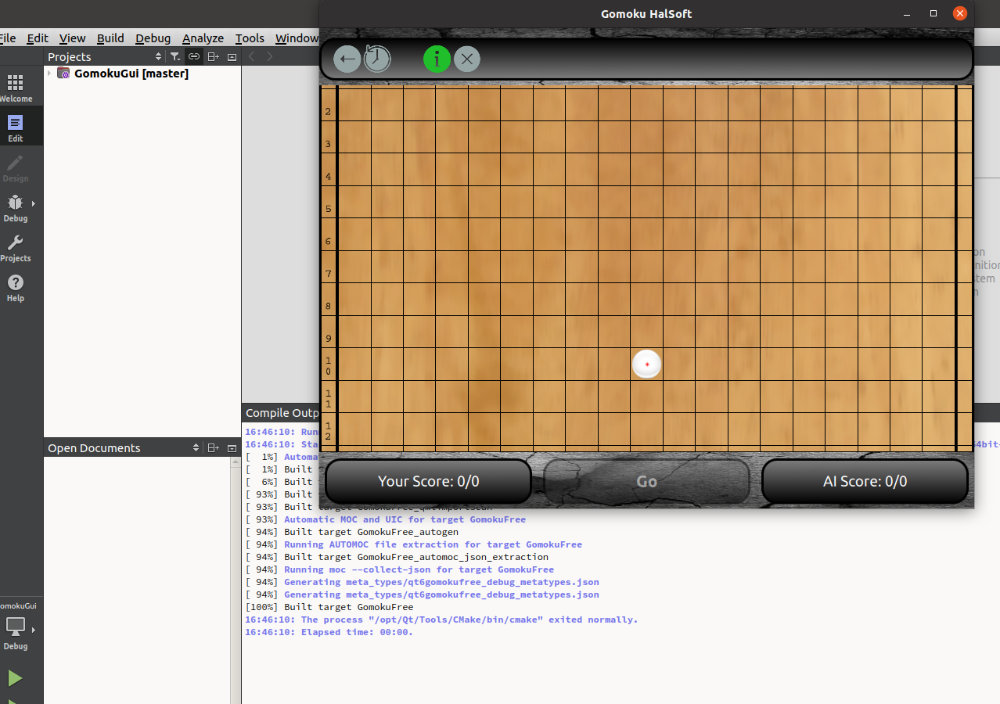

## How to build

To set up Jenkins use [Jenkins Docker](https://github.com/zhalat/Gomoku/blob/master/a.src/ci/dockers/docker_jenkins/Dockerfile)
Then use [Jenkinsfile](https://github.com/zhalat/Gomoku/blob/master/a.src/ci/Jenkinsfile)  to get all pipeline.

---

If you don't want setting Jenkins, here is alternative:    

*There are three ways to build the code depending on your needs.*
- *android GUI arm7 CI - full android application. Use it for release*
- *PC GUI x86 - usefull for developing GUI. You will use Qt IDE*
- *console GUI -  usefull for deveoping engine.*

*All steps requires to have prepared environment.   
See [How to setup toolchain](HowToSetupToolchain.md)*

---

```
/home/zby/repos/Gomoku                                #where you downloaded repo
/home/zby/repos/Gomoku/a.src/frontend/GUI/build       #build output
```
---

- **android GUI arm7 CI** (usefull for CI or release)
```
#[cmake]
/home/zby/Qt/Tools/CMake/bin/cmake -S /home/zby/repos/Gomoku/a.src/frontend/GUI -B /home/zby/repos/Gomoku/a.src/frontend/build_gui -DCMAKE_GENERATOR:STRING="Unix Makefiles" -DCMAKE_BUILD_TYPE:STRING=Release  -DQT_QMAKE_EXECUTABLE:FILEPATH=/home/zby/Qt/6.6.3/android_armv7/bin/qmake -DCMAKE_PREFIX_PATH:PATH=/home/zby/Qt/6.6.3/android_armv7 -DCMAKE_C_COMPILER:FILEPATH=/home/zby/Android/Sdk/ndk/25.1.8937393/toolchains/llvm/prebuilt/linux-x86_64/bin/clang -DCMAKE_CXX_COMPILER:FILEPATH=/home/zby/Android/Sdk/ndk/25.1.8937393/toolchains/llvm/prebuilt/linux-x86_64/bin/clang++ -DANDROID_PLATFORM:STRING=android-23 -DANDROID_NDK:PATH=/home/zby/Android/Sdk/ndk/25.1.8937393 -DCMAKE_TOOLCHAIN_FILE:FILEPATH=/home/zby/Android/Sdk/ndk/25.1.8937393/build/cmake/android.toolchain.cmake -DANDROID_USE_LEGACY_TOOLCHAIN_FILE:BOOL=OFF -DANDROID_ABI:STRING=armeabi-v7a -DANDROID_STL:STRING=c++_shared -DCMAKE_FIND_ROOT_PATH:PATH=/home/zby/Qt/6.6.3/android_armv7 -DQT_NO_GLOBAL_APK_TARGET_PART_OF_ALL:BOOL=ON -DQT_HOST_PATH:PATH=/home/zby/Qt/6.6.3/gcc_64 -DANDROID_SDK_ROOT:PATH=/home/zby/Android/Sdk -DProtobuf_DIR:STRING=/home/zby/Android/protobuf-v5.27.0-rc3/lib/cmake/protobuf -Dutf8_range_DIR:STRING=/home/zby/Android/protobuf-v5.27.0-rc3/lib/cmake/utf8_range -Dabsl_DIR:STRING=/home/zby/Android/abseil/lib/cmake/absl -DGTest_DIR:STRING=/home/zby/Android/gtest1.14/lib/cmake/GTest

#[build]
cd /home/zby/repos/Gomoku/a.src/frontend/build_gui 
make

#[deploy to get apk files]
"/home/zby/Qt/6.6.3/gcc_64/bin/androiddeployqt" --input /home/zby/repos/Gomoku/a.src/frontend/build_gui/android-GomokuFree-deployment-settings.json --output /home/zby/repos/Gomoku/a.src/frontend/build_gui/android-build --android-platform android-34 --jdk /usr/lib/jvm/java-11-openjdk-amd64 --gradle --release
```
After that, you will get apk in location:
```/home/zby/repos/Gomoku/a.src/frontend/build_gui/android-build/build/outputs/apk/release/android-build-release-unsigned.apk```  
See [How to deploy](HowToDeploy.md)  
to get to know how to deploy it onto your mobile phone.

- **PC GUI x86** (usefull for testing GUI)
    - open project

    - choose kits (android is optional)

    - select x86 kits
      
Compile & run!
 

---
- **console GUI** (usefull for testing & developing backend==engine)
```
#[cmake]
cmake -S /home/zby/repos/Gomoku/a.src/frontend/CLI -B /home/zby/repos/Gomoku/a.src/frontend/build_cli -DCMAKE_BUILD_TYPE=Debug  -DCMAKE_TOOLCHAIN_FILE="/home/zby/repos/Gomoku/a.src/backend/cmake/toolchain-gcc-default.cmake" -DCMAKE_EXPORT_COMPILE_COMMANDS=ON

#[build binaries]
cd /home/zby/repos/Gomoku/a.src/frontend/build_cli
make 
```
