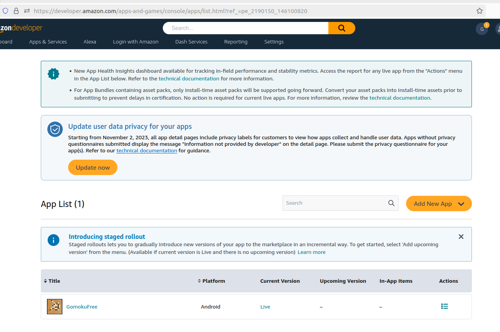

## How to deploy
*Use it when you want to test application on your phone.  
It is assumed you have already ```android-build-release-unsigned.apk```*
See [How to build](c.doc/HowToBuild.md.md)*

---

You will be using ```adb``` tool to connecting/upload/log of your phone.  
```adb``` is instaled in .vdi and docker.

0. discover phone  
```
zby@zby-ThinkPad:~$ adb devices
List of devices attached
4815ed70	device
```
1. signing the app   
- generate a key
```
keytool -genkey -v -keystore my-release-key.keystore -alias alias_name -keyalg RSA -keysize 2048 -validity 10000
```
-  sing app
```
apksigner sign --ks my-release-key.keystore --ks-key-alias <path_to_app>/android-build-release-unsigned.apk
```
2. uploading  
```
adb -s 4815ed70 install <path_to_app>/android-build-release-unsigned.apk
```
---
### Releasing:
So far app has been released to amazon app story:
  - [Amazon app](https://developer.amazon.com/apps-and-games/console/apps/list.html?ref_=pe_2190150_146100820)  
 Name: **GomokuFree**
 