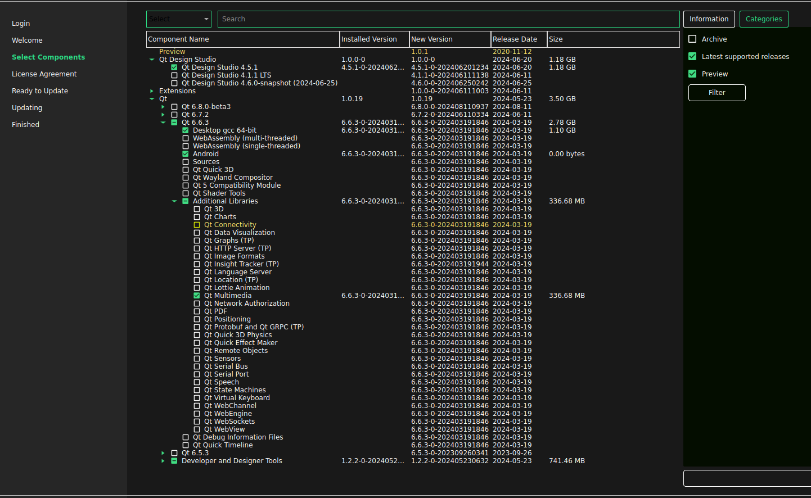

## How to setup envirnoment
*There is prepared virtual machine .vdi you can use for development or docker images for CI.   
[DockerQT6](https://hub.docker.com/repository/docker/ginar/android_qt6_img/general)  
However you can do it from scratch*

---

1. Log in to qt account:  
 https://login.qt.io/login  

```
zby.halat.backup@gmail.com
xxxxxx
```

2. Download online installer:  
https://www.qt.io/download-qt-installer 

3. Components to install  
Minimalistic setup is *Qt for Desktop* and *QT for Android*  


4. Configuration  
- Install java sdk & git & OpenGL development lib
```
sudo apt-get install git
sudo apt install default-jdk
sudo apt-get install libglu1-mesa-dev freeglut3-dev mesa-common-dev
```
- Android sdk  
There is problem to install it via GUI.
I had to install it manually. If so, below are command what to do.
If you were able to install it via GUI go to next section.


- commands to install android sdk:  
Go to ``/home/zby/Android/Sdk``
```
wget https://dl.google.com/android/repository/commandlinetools-linux-9123335_latest.zip
```
Extract it. You should get:   


```
export ANDROID_HOME=/home/zby/Android/Sdk
export PATH=$PATH:$ANDROID_HOME/cmdline-tools/latest/bin
export PATH=$PATH:$ANDROID_HOME/platform-tools
source ~/.bashrc
```
You should be able to run command:
```
sdkmanager --list
```
If so install the packets
```
sdkmanager "platform-tools"
sdkmanager "platforms;android-30" "build-tools;30.0.3"
```
After that you should have no red warnings in Devices->Androdid tab.

5. Kits  
Only Desktop PC kits is auto-detected.  
Fro Android you have to add it manually


6. Additional library needed by app
In order to use protobuf on android your toolchain (which is ndk: ```~/Android/Sdk/ndk/25.1.8937393/toolchains/llvm/prebuilt/linux-x86_64/bin)``` must see it.
By default it is not installed so you have to install it from source.

- abseil library [dependency to protobuf]
```
git clone git@github.com:abseil/abseil-cpp.git  
git checkout 20240116.rc2
mkdir build
cd build
cmake .. -DCMAKE_TOOLCHAIN_FILE=/home/zby/Android/Sdk/ndk/25.1.8937393/build/cmake/android.toolchain.cmake \
        -DANDROID_ABI="armeabi-v7a" \
        -DANDROID_PLATFORM=android-23 \
        -DCMAKE_BUILD_TYPE=Release \
        -DCMAKE_INSTALL_PREFIX=$HOME/Android/abseil
sudo make install
```

- google test library
```
git@github.com:google/googletest.git
git checkout v1.14.0-pre
mkdir build
cd build
cmake .. -DCMAKE_TOOLCHAIN_FILE=/home/zby/Android/Sdk/ndk/25.1.8937393/build/cmake/android.toolchain.cmake \
         -DANDROID_ABI="armeabi-v7a" \
         -DANDROID_PLATFORM=android-23 \
         -DCMAKE_INSTALL_PREFIX=$HOME/Android/gtest1.14 \
         -DCMAKE_BUILD_TYPE=Release
sudo make install
```
- protobuf library 
remember you have to use your toolchain. Notice that from some version (at least 25.1) ndk provides cmake toolchain file android.toolchain.cmake, so you can use it
for cross compilation DCMAKE_TOOLCHAIN_FILE= ...android.toolchain.cmake. We will use it.
```
git clone git@github.com:protocolbuffers/protobuf.git
git checkout v5.27.0-rc3
mkdir build
cd build
cmake .. \
-DCMAKE_TOOLCHAIN_FILE=/home/zby/Android/Sdk/ndk/25.1.8937393/build/cmake/android.toolchain.cmake \
-DANDROID_ABI="armeabi-v7a" \
-DANDROID_PLATFORM=android-23 \
-DCMAKE_INSTALL_PREFIX=$HOME/Android/protobuf-v5.27.0-rc3 \
-DCMAKE_BUILD_TYPE=Release \
-Dprotobuf_BUILD_TESTS=OFF \
-Dprotobuf_ABSL_PROVIDER=package \
-Dabsl_DIR=$HOME/Android/abseil/lib/cmake/absl

sudo make install
```


